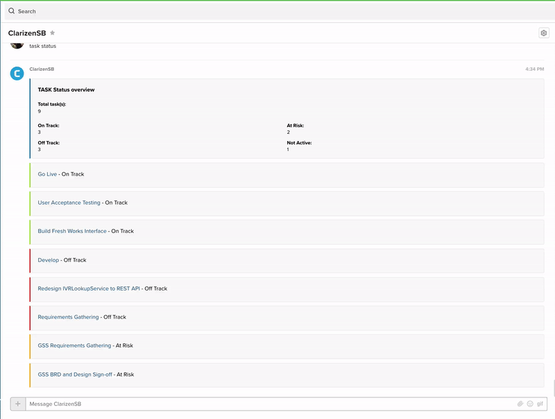

# Glip Clarizen Bot

Clarizen Bot lets you stay up-to-date with your projects without leaving Glip. Get immediate information you need without having to remember tricky commands.
Once you’ve connected with Clarizen, Clarizen Bot can retrieve project statuses, project states, task statuses, and task states for you, with more features coming soon.

## Table of Contents

-   [Availability](#Availability)
-   [Feedback](#We-want-your-feedback)
-   [Commands](#Commands)
-   [Status](#Status)
-   [State](#State)
-   [Examples](#Examples)
-   [Aliases](#Aliases)
-   [Syntax](#Syntax)

## Availability

Clarizen bot is in its first stages of development and is only available only to RC employees at this time.

## We want your feedback

We'd love to hear your feedback about Clarizen Bot. If you spot bugs or have features that you'd really like to see, please check out the [bug and feature submission form](https://forms.gle/KKYKVVoxUN5z32dY7).

## Getting started

### Installation

Clarizen bot has already been installed on Glip and all you need to do is run a global search for "Clarizen" and click the bot that looks like this:


## Commands

Right now, Clarizen bot understands a few commands. For help with syntax please refer to the [syntax section](#Syntax). For the sake of simplicity `state` and `status` arguments have been split into two examples:

#### Status

```
{ project | task } status [ on-track | off-track | at-risk | not-active ]
```

The first argument determines whether you want a `project` or a `task`. The second argument can be `status` or `state`. `task status` is a valid command and will return **all** tasks and their statuses. This is true with `project status` as well.
You then have the **option** to filter by the status (`on-track`,`off-track`,`at-risk`, or `not-active`) of the `project` or `task` by appending one of those keywords to the end of the command. Example: `project status on-track` or `task status off-track`

#### State

```
{ project | task } state [ active | completed | cancelled | not-active]
```

The first argument determines whether you want a `project` or a `task`. The second argument can be `status` or `state`. `task state` is a valid command and will return **all** tasks and their states. This is true with `project state` as well.
You then have the **option** to filter by the `state` (`active`,`off-track`,`cancelled`, or `not-active`) of the `project` or `task` by appending one of those keywords to the end of the command. **Projects or tasks that are labels as `draft` will not be listed.** 

Example: `project state completed` or `task state active`

## Examples



-   `project status` - Lists all `projects` and their `status`
-   `project state` - Lists all `projects` and their state
-   `task status` - Lists all `tasks` and their `status`
-   `task state` - Lists all `tasks` and their state
-   `task status on-track` - Lists all `tasks` with a `status` of `on-track`
-   `task state cancelled` - Lists all `projects` with a `state` of `cancelled`
-   `project status at-risk` - Lists all `tasks` with a `status` of `at-risk`

To shorten commands Clarizen bot also recognizes aliases. Please refer to the [alias section](#Aliases)

### Aliases

| Keyword      | Alias |
| ------------ | ----- |
| `project`    | `p`   |
| `task`       | `t`   |
| `status`     | `stu` |
| `state`      | `sta` |
| `on-track`   | `on`  |
| `off-track`  | `off` |
| `at-risk`    | `ar`  |
| `not-active` | `na`  |
| `active`     | `a`   |
| `completed`  | `co`  |
| `cancelled`  | `ca`  |

Examples:

-   `p sta` - `project state`
-   `t stu off` - `task status off-track`

### Syntax

##### Required commands

-   Required commands look like this: `example`
    -   this means you must type `example` or the command won't work.
-   Required commands where there is a choice are wrapped with `{}`.
    -   `{yes | no}` - means you must choose `yes` or `no` or the command won't work.

##### Optional commands

-   Optional commands are wrapped in `[]`
    -   `[cat | dog]` - means you can choose to add cat or dog at that location but its not required.
